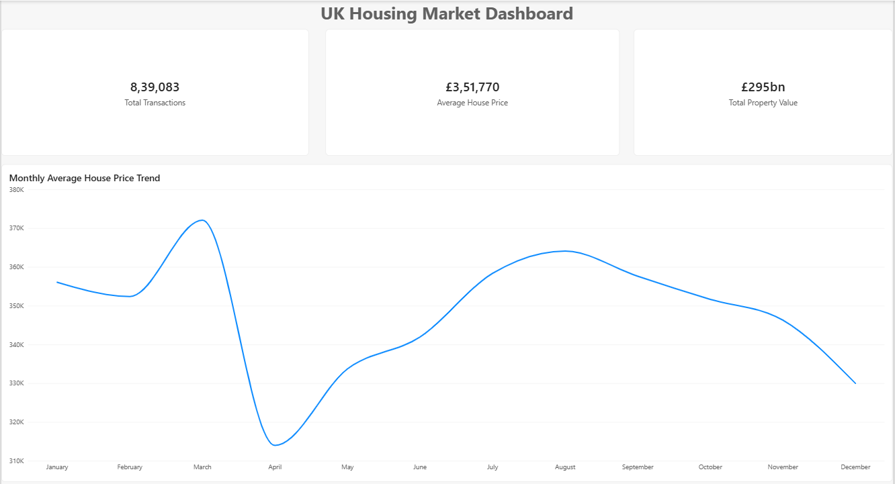
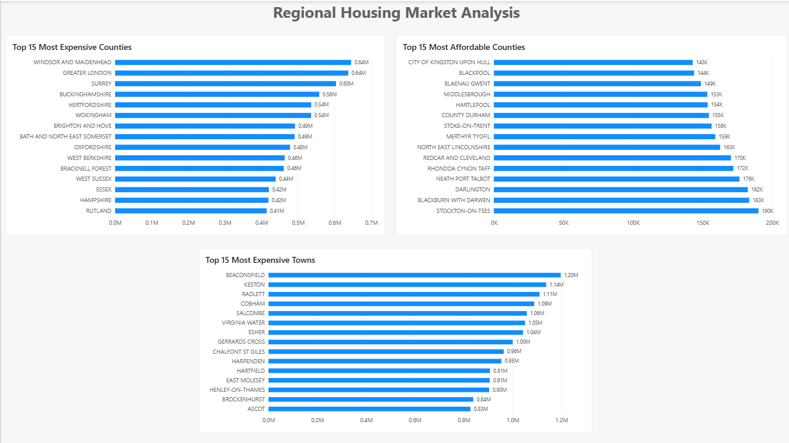
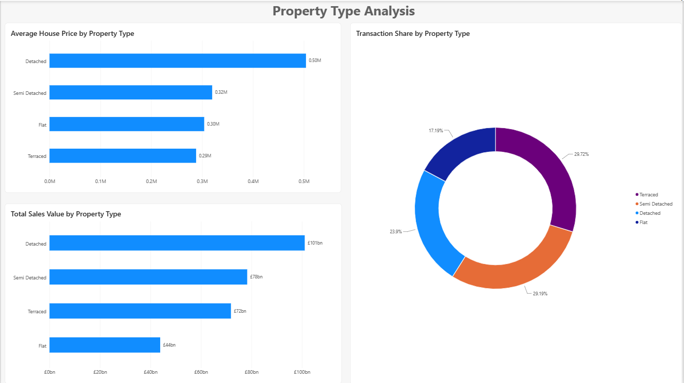

# UK Housing Market Analytics

## Project Overview

This project analyses UK housing market data using PostgreSQL to uncover trends in property prices, property types, transaction activity, and regional housing market performance.

The analysis uses HM Land Registry Price Paid Data and focuses on transforming raw property transaction records into meaningful business insights through data validation, cleaning, and SQL analysis.

---

## Business Problem

A property investment company wants to better understand housing market trends across the UK.

The objective is to identify property market patterns, understand transaction activity, compare property types, analyse regional differences, and prepare the data for future business intelligence reporting.

---

## Dataset Information

Source: HM Land Registry Price Paid Data

The dataset contains property transactions recorded across England and Wales, including:

- Property Price
- Transaction Date
- Property Type
- Postcode
- Town or City
- District
- County
- Ownership Type

---

## Dataset Size

- Original Dataset: 879,386 records
- Cleaned Residential Dataset: 839,083 records

---

## Project Workflow

1. Data Import into PostgreSQL
2. Data Validation
3. Data Cleaning
4. Exploratory Data Analysis
5. Business Analysis

---

## Data Validation

The following validation checks were performed:

- Verified successful import of all records
- Reviewed sample records for accuracy
- Checked for missing postcode values
- Identified minimum, maximum, and average property prices

### Validation Results

- Total Records Imported: 879,386
- Minimum Price: £1
- Maximum Price: £793,020,000
- Average Price: £383,655

---

## Data Cleaning

A residential housing view was created to improve analytical accuracy.

Cleaning steps:

- Removed commercial and non residential transactions
- Removed ownership transfers and nominal value transactions
- Filtered prices outside the range £10,000 to £5,000,000
- Retained only detached, semi detached, terraced and flat properties

### Cleaning Results

- Original Records: 879,386
- Residential Records: 839,083
- Average Residential Property Price: £351,770

---

## Initial Findings

### Property Type Distribution

| Property Type | Transactions |
|---|---:|
| Terraced | 249,541 |
| Semi Detached | 244,963 |
| Detached | 200,678 |
| Flat | 144,344 |
| Other | 39,860 |

### New Build vs Existing Properties

| Property Status | Transactions |
|---|---:|
| Existing Properties | 840,445 |
| New Build Properties | 38,941 |

### Ownership Type

| Ownership Type | Transactions |
|---|---:|
| Freehold | 687,137 |
| Leasehold | 192,249 |

### Key Observations

- Terraced properties recorded the highest transaction volume.
- Existing properties represented the majority of housing transactions.
- Freehold properties accounted for most residential sales.
- Significant price outliers were identified and removed before residential analysis.

---

## Regional Analysis

### Most Expensive Counties

| County | Average Price |
|---|---:|
| Windsor and Maidenhead | £644,918 |
| Greater London | £637,160 |
| Surrey | £603,798 |
| Buckinghamshire | £557,965 |
| Hertfordshire | £536,067 |

### Most Affordable Counties

| County | Average Price |
|---|---:|
| City of Kingston upon Hull | £142,863 |
| Blackpool | £143,877 |
| Blaenau Gwent | £148,803 |
| Middlesbrough | £153,343 |
| Hartlepool | £153,619 |

### Key Observations

- The highest property prices were concentrated around London and the South East.
- Windsor and Maidenhead recorded the highest average county level property price.
- There is a significant affordability gap between premium southern counties and lower priced northern and Welsh regions.

---

## Property Type Analysis

### Average Price by Property Type

| Property Type | Average Price | Transactions |
|---|---:|---:|
| Detached | £504,178 | 200,543 |
| Semi Detached | £319,783 | 244,913 |
| Flat | £304,094 | 144,217 |
| Terraced | £288,200 | 249,410 |

### Property Type Share

| Property Type | Share |
|---|---:|
| Terraced | 29.72% |
| Semi Detached | 29.19% |
| Detached | 23.90% |
| Flat | 17.19% |

### Key Observations

- Detached properties recorded the highest average price.
- Terraced properties were the most frequently sold property type.
- Detached properties sold for approximately £216,000 more than terraced properties on average.

---

## Market Trends

### Key Observations

- March 2025 recorded the highest average residential property price at £372,063.
- March 2025 also recorded the highest transaction volume with 137,497 sales.
- April 2025 recorded the lowest average property price at £313,966.
- Housing market activity varied significantly across the year.

---

## County and Property Type Analysis

### Key Observations

- Detached houses in Greater London recorded the highest average price at £1,102,853.
- Detached properties dominated the most expensive county and property type combinations.
- Greater London flats averaged £511,425, which is higher than detached homes in many other counties.
- Location and property type both have a major impact on price.

---

## Market Activity Analysis

### Highest Activity Housing Markets

| County | Transactions | Average Price |
|---|---:|---:|
| Greater London | 92,505 | £637,160 |
| Greater Manchester | 39,096 | £266,749 |
| West Yorkshire | 33,018 | £238,362 |
| West Midlands | 31,774 | £258,622 |
| Kent | 23,949 | £397,975 |

### Key Observations

- Greater London recorded the highest housing market activity.
- Greater Manchester, West Yorkshire and West Midlands had high transaction volumes with much lower average prices than London.
- High transaction volume does not always mean high property prices.

---

## Tools Used

- PostgreSQL
- Power BI
- DAX
- Microsoft Excel
- HM Land Registry Price Paid Data

---

## Power BI Dashboard

The final dashboard was developed in Power BI and consists of three interactive pages designed to provide different perspectives on the UK housing market.

### Market Overview

- Total Transactions
- Average House Price
- Total Property Value
- Monthly Average House Price Trend

### Regional Analysis

- Top 15 Most Expensive Counties
- Top 15 Most Affordable Counties
- Top 15 Most Expensive Towns

### Property Type Analysis

- Average House Price by Property Type
- Total Sales Value by Property Type
- Transaction Share by Property Type

---

## Dashboard Preview

### Market Overview

### Regional Analysis

### Property Type Analysis

---

## Skills Demonstrated

- SQL Data Cleaning
- Data Validation
- Exploratory Data Analysis (EDA)
- Data Transformation
- Data Visualization
- Dashboard Development
- DAX Measures
- KPI Reporting
- Business Analysis
